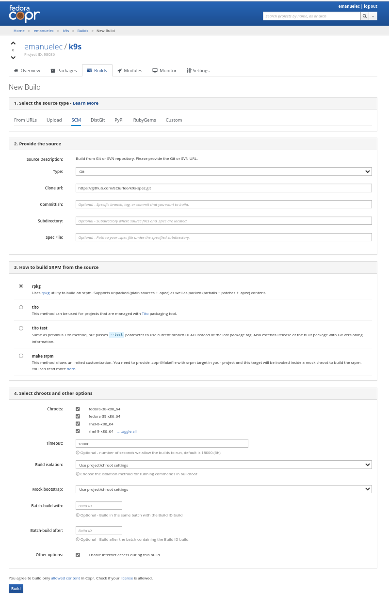

# K9s packages RPM packages for; 

* Amazonlinux 2023	x86_64
* Centos-stream 10	x86_64
* Centos-stream 9	x86_64
* EPEL 10	x86_64
* EPEL 8	x86_64
* EPEL 9	x86_64
* Fedora 40	x86_64
* Fedora 41	x86_64
* Fedora 42	x86_64
* Fedora rawhide	x86_64
* openSUSE Leap 15.5	x86_64
* openSUSE Tumbleweed	x86_64
* Rhel 9

# k9s-spec

## Copr will rebuild automatically using a webhook
https://docs.pagure.org/copr.copr/user_documentation.html#github 

## To build a new version of k9s using Copr Manually

1. Update k9s.spec to reflect the [verison required](https://github.com/derailed/k9s/releases)

2. Build as SCM
https://copr.fedorainfracloud.org/coprs/emanuelec/k9s/add_build_scm/

3. The git URL is this repo 
https://github.com/ECiurleo/k9s-spec.git

4. Select ¨Enable internet access during this build¨

The rest should remain default

