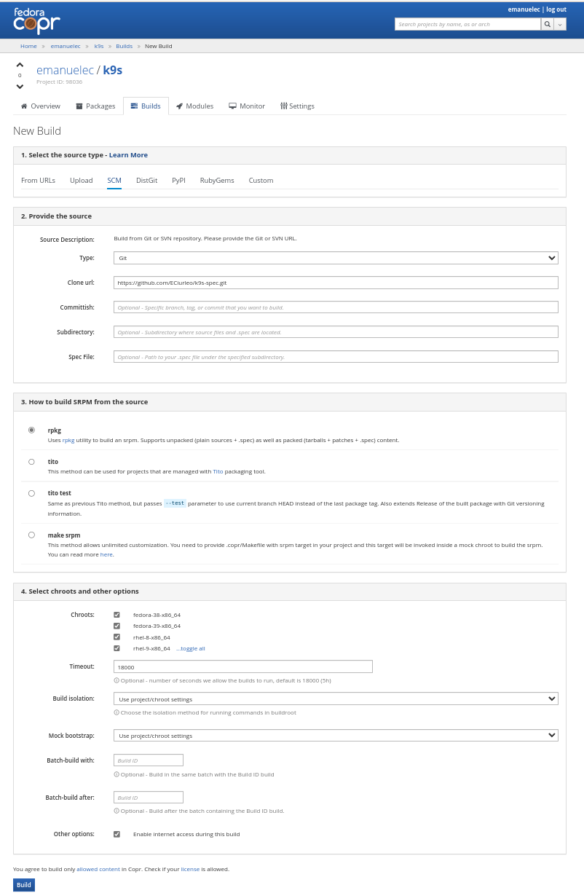

# K9s packages RPM packages for; 

* Amazonlinux 2023	x86_64
* Centos-stream 10	x86_64
* Centos-stream 9	x86_64
* EPEL 10	x86_64
* EPEL 9	x86_64
* Fedora 41	x86_64
* Fedora 42	x86_64
* Fedora rawhide	x86_64
* Rhel 9
* Rhel 10

# k9s-spec

## Automatic weekly version updates

This repo includes a GitHub Actions workflow that runs weekly and checks the latest release from https://github.com/derailed/k9s/releases.

If a new release is found, it will:

1. Update `Version` in `k9s.spec`
2. Add a new `%changelog` entry
3. Commit and push to the default branch

Because Copr is already watching this repository, that push triggers a new build automatically.

You can also run it manually from the Actions tab using `workflow_dispatch`.

## Copr will rebuild automatically using a webhook
https://docs.pagure.org/copr.copr/user_documentation.html#github 

## To build a new version of k9s using Copr Manually

1. Update k9s.spec to reflect the [verison required](https://github.com/derailed/k9s/releases)
2. Update k9s.spec %changelog to reflect the new version and the date of the build. 

3. Build as SCM
https://copr.fedorainfracloud.org/coprs/emanuelec/k9s/add_build_scm/

4. The git URL is this repo 
https://github.com/ECiurleo/k9s-spec.git

5. Select ¨Enable internet access during this build¨

The rest should remain default

